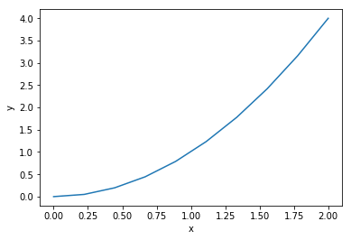
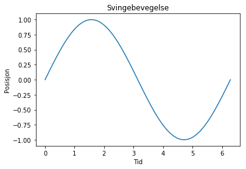
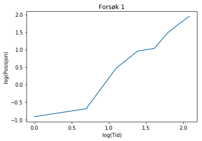
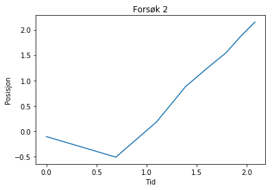
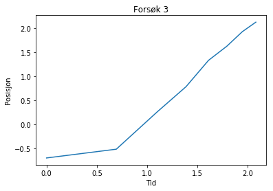
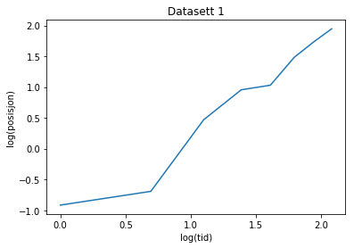
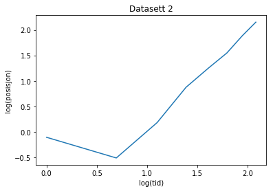
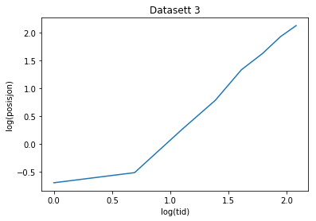
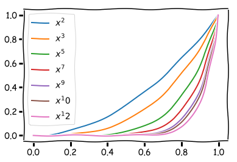

# Funksjoner


{:.input_area}
```python
from pylab import *
```


I programmering betyr funksjon mye mer enn det gjør i matematikken. I hovedsak så er en funksjon en samling instruksjoner som hører sammen, og som til sammen utfører en oppgave som vi kan sette et navn på. Gjerne noe vi ønsker å kunne utføre flere ganger uten å måtte skrive opp de samme instruksjonene flere ganger. 

En funksjon i sin enkleste for kan være for eksempel slik: 


{:.input_area}
```python
def f(a):
    return a**2
```


Her har vi valgt en funksjon som likner på dem vi kjenner fra matematikken. 

Vi kan *kalle på* denne funksjonen for å få verdier fra den


{:.input_area}
```python
verdi = f(2)
print(verdi)
```


{:.output .output_stream}
```
4

```

Og vi kan plotte verdiene, slik som vi nettopp lærte. 


{:.input_area}
```python
x = linspace(0, 2, 10)
y = f(x)

plot(x, y)
xlabel("x")
ylabel("y")
show()
```


{:.output .output_png}



 
De grunnleggende elementene i en funksjon i Python er

```python
def minFunksjon(argument):
    <gjør noe>
    return <returvariable>
```

Vi skriver ordet `def` for å si til python at det kommer en funksjon. Så skriver vi opp det vi vil at funksjonen skal hete, og i parentes bak navnet skriver vi hvilke argumenter funksjonen skal kunne ta imot. Så kommer `:`, som forteller at vi nå skal gå over til innholdet i funksjonen. Innholdet, altså det som skal utføres i funksjonen, ligger på de neste linjene med innrykk. Innholdet i funksjonen fortsetter helt til vi kommet til en linje som ikke er rykket inn i forhold til `def`-ordet. Funksjonen sier seg ferdig enten når den møter `return`, altså der funksjonen returnerer, eller hvis den når bunnen av det innrykkede området.  

Merk at vi gjør en distinksjon mellom å *definere* funksjonen og det å *kalle* på funksjonen. Det er når vi *kaller* på funksjonen at koden i funksjonen faktisk kjører. 

Vi kaller på funksjonen med funksjonsnavn etterfulgt av parenteser der vi putter inn argumentet. 
```python
minFunksjon(arg)
```
eller 
```python
x = minFunksjon(arg)
``` 

Vi skal først passe på at vi kan syntaks for å definere og å kalle på funksjoner. Derfor går vi rett på første underveisoppgave. 

### Underveisoppgave
**a)** Programmer en funksjon som konverterer Celsiusgrader til Fahrenheit. Du har sikkert lyst på å vite at $T_F = \frac{9}{5} T_C + 32$  
**b)** Kall på funksjonen for å regne ut funksjonsverdier som du kan plotte. 

Husk at

```python
def minFunksjon(argument):
    <gjør noe>
    return <returvariable>
```

```python
x = minFunksjon(arg)
```

f. eks. 
```python
def f(a): 
    return a**2

y = f(4)
```


> **Oppgaven er ment å trene**
- Syntaks 
- Kalle på funksjoner


I programmering er det vanlig at vi lager oss funksjoner for å sette et navn på noe slik at vi kan huske det. For et menneske kan det være fint å ha en funksjon som heter noe som sier hva funksjonen gjør eller kan brukes til. For eksempel kan vi ta for oss vinkelen mellom to vektorer. Den kan vi godt kalle for `vektorVinkel`, slik at et menneske kan forstå hva den gjør. Her skal vi også se at funksjoner godt kan ta mer enn ett argument. 


Formelen for vinkelen mellom to vektorer  
$\cos \angle(a, b) = \frac{\overrightarrow a\cdot \overrightarrow b}{ |\overrightarrow a| |\overrightarrow b]}$


{:.input_area}
```python
def vektorVinkel(a, b): 
    # Regner ut vinkelen mellom to vektorer. 
    len_a = sqrt(dot(a,a))
    len_b = sqrt(dot(b,b))
    cosvinkel = dot(a, b)/(len_a*len_b)
    vinkel = arccos(cosvinkel) # Det vi er vant til at heter cos^-1 heter arccos i python
    return vinkel
    
```


{:.input_area}
```python
vektor_a = array([1,2]) # konvertering direkte til array
vektor_b = array([2,3])

vinkel_ab = vektorVinkel(vektor_a, vektor_b)
# i python sånn som vi har satt opp med pylab import *, så regner vi alltid i radianer. 
print("Vinkelen mellom ", vektor_a, "og", vektor_b, "er ", round(vinkel_ab,3), "rad\n", "altså", round(degrees(vinkel_ab), 2), "grader")
```


{:.output .output_stream}
```
Vinkelen mellom  [1 2] og [2 3] er  0.124 rad
 altså 7.13 grader

```

### Underveisoppgave

**a)** Skriv inn funksjonen `vektorVinkel` på egen maskin. Kall på den med to vektorer.  
**b)** Gjør om a til en 3D-vektor og prøv igjen. Gjør så også b til en 3D-vektor og prøv igjen.   
**c)** Hvilken funksjon er det som avgjør om det går bra eller ikke å sette inn 3D-vektorer her?


```python
def vektorVinkel(a, b): 
    len_a = sqrt(dot(a,a))
    len_b = sqrt(dot(b,b))
    cosvinkel = dot(a, b)/(len_a*len_b)
    vinkel = arccos(cosvinkel)
    return vinkel
```

> **Oppgaven er ment å trene**
- Funksjoner kan ha flere linjer kode før `return`
- Skrive inn flere linjer kode uten feil, eller feilsøke. Her er det en del parenteser, så feilsannsynligheten er stor, men feilene skal ikke være så vanskelige å løse
- Skrive og kalle på funksjoner med flere argumenter
- Bruk av funksjon inni funksjon. Vi gjør det eksplisitt gjennom poenget med dot-funksjonen

> **Forklaringer**
- Noen funksjoner tåler å ta imot arrays. Det gjelder de fleste matematiske funksjonene. Men dot-produktet krever at arraysene har samme lengde, ellers gir ikke skalarproduktet mening, og vi får en feilmelding.

## Funksjoner som ikke er matematiske (i skolematematisk forstand)

Så funksjoner i programmering er beslektet med funksjoner i matematikken. Eller kanskje mer presist: Vi kan få funksjoner i programmering til å gjøre de tingene som funksjoner i matematikken gjør. Men vi kan også få dem til å gjøre så mye mer!

Vi kan for eksempel jobbe litt med en streng


{:.input_area}
```python
def fulltNavn(fornavn, etternavn):
    return fornavn + " " + etternavn

fulltNavn("Ola", "Normann")
```


{:.output .output_data_text}
```
'Ola Normann'
```


Python tolker ikke det å legge sammen to strenger som noe matematisk. Den velger rett og slett bare å sette sammen strengene, som om $2 + 3 = 23$. 


Eller vi kan se på noe som ble annerledes enn vi kanskje hadde tenkt oss:


{:.input_area}
```python
def g(a, b, c, x):
    y = a*x**2 + b*x + c
    
print(g(2, 4, 1, 7))
```


{:.output .output_stream}
```
None

```

Her ser jo alt veldig matematisk ut, og vi regner ut et annengradsuttrykk. Men når det kommer til stykket så returnerer vi ingenting, og da er det jo ikke en matematisk funksjon. 

Vi kan definere `g` på nytt med en print inni


{:.input_area}
```python
def g(a, b, c, x):
    y = a*x**2 + b*x + c
    print("g(", a, ",", b, ",", c, ",",x,") = ", y)
    
g(2, 4, 1, 7)
```


{:.output .output_stream}
```
g( 2 , 4 , 1 , 7 ) =  127

```

Vi returnerer fremdeles ingenting, men nå får vi i det minste se hva som har blitt regnet ut inni funksjonen. 

### Underveisoppgave
c) Modifiser funksjonen med konvertering fra Celsius til Fahrenheit slik at i stedet for å returnere et tall, så returnerer den en streng som sier noe slikt som "XX grader Celsius tilsvarer XX grader Fahrenheit"

> **Oppgaven er ment å trene**
- Programmeringsfunksjoner trenger ikke være matematiske
- Input og output trenger ikke å ha samme type

Vi kan returnere alt fra ingen til mange variable. Der det er flere enn én returvariabel skiller vi dem med komma. Vi kan også lage funksjoner som ikke returnerer, men som bare gjør noe. 


{:.input_area}
```python
def figurMinimum(x, y, xaksetekst, yaksetekst, tittel):
    plot(x, y) 
    xlabel(xaksetekst)
    ylabel(yaksetekst)
    title(tittel)
    
x = linspace(0, 2*pi)
y = sin(x)

figurMinimum(x, y, "Tid", "Posisjon", "Svingebevegelse")
```


{:.output .output_png}



Om vi skal være pirkeformelle, så kan vi legge til at funksjoner som ikke returnerer noe rent faktisk returnerer `None`, som er et objekt av typen `NoneType`.


{:.input_area}
```python
def f(x): 
    y = x**2
    
print(f(3))
print(type(f(3)))
```


{:.output .output_stream}
```
None
<class 'NoneType'>

```

## Funksjon kaller på funksjon


Det er ikke noe i veien for å kalle på funksjoner inni funksjoner. Pass da bare på at funksjonene er definert i riktig rekkefølge, slik at funksjonen som kaller på en annen funksjon er definert etter funksjonen som den kaller på:


{:.input_area}
```python
def kontrollerNavn(navn):
    # Følger navnet reglene vi har satt for navn?
    if len(navn) < 2:
        return False
    elif navn[0].islower():
        return False
    else:
        return True

def fulltNavn(fornavn, etternavn):
    if not kontrollerNavn(fornavn):
        print("Fornavnet", fornavn, "er ikke gyldig")
        return None
    if not kontrollerNavn(etternavn):
        print("Etternavnet", etternavn, "er ikke gyldig")
        return None
    else:
        return fornavn + " " + etternavn
        

print(fulltNavn("Eirik", "Jensen"))

    
```


{:.output .output_stream}
```
Eirik Jensen

```

Når sant skal sies, så har vi faktisk drevet med å kalle på funksjoner inni funksjoner gjennom hele økta. For både `dot`, `arccos`og `sqrt`er funksjoner. Disse er riktignok *innebygde* funksjoner, men det betyr bare at det er noen andre som har laget dem, med `def`, `return`og hele pakka. De oppfører seg akkurat som dem vi lager selv. 

### Underveisoppgave

Lag en funksjon som beregner arealet som utspennes mellom to vektorer.  
Det kan hende du har lyst på formelen $\frac{1}{2} ab \sin{(\angle \overrightarrow a,  \overrightarrow b)}$. Glem heller ikke at vi beregnet vinkelen mellom vektorene tidligere i økta med funksjonen `vektorVinkel`. 

> **Oppgaven er ment å trene**
- Funksjon i funksjon
- Repetisjon av syntaks

### Oppgave – Rydd opp i koden

I koden under skal vi behandle et par datasett. Vi har gjort det på en kronglete måte. Rydd opp i koden slik at den blir mer oversiktlig. 


{:.input_area}
```python
tid1 = np.asarray([1, 2, 3, 4, 5, 6, 7, 8])
posisjon1 = array([0.4, 0.5, 1.6, 2.6, 2.8, 4.4, 5.7, 7.0])

tid2 = np.asarray([1, 2, 3, 4, 5, 6, 7, 8])
posisjon2 = array([0.9, 0.6, 1.2, 2.4, 3.5, 4.7, 6.6, 8.6])

tid3 = np.asarray([1, 2, 3, 4, 5, 6, 7, 8])
posisjon3 = array([0.5, 0.6, 1.3, 2.2, 3.8, 5.1, 6.9, 8.4])

plot(log(tid1), log(posisjon1))
xlabel("log(Tid)")
ylabel("log(Posisjon)")
title("Forsøk 1")

figure()
plot(log(tid2), log(posisjon2))
xlabel("Tid")
ylabel("Posisjon")
title("Forsøk 2")

figure()
plot(log(tid3), log(posisjon3))
xlabel("Tid")
ylabel("Posisjon")
title("Forsøk 3")
```


{:.output .output_data_text}
```
Text(0.5,1,'Forsøk 3')
```


{:.output .output_png}



{:.output .output_png}



{:.output .output_png}



{:.input_area}
```python
tid1 = np.asarray([1, 2, 3, 4, 5, 6, 7, 8])
posisjon1 = array([0.4, 0.5, 1.6, 2.6, 2.8, 4.4, 5.7, 7.0])

tid2 = np.asarray([1, 2, 3, 4, 5, 6, 7, 8])
posisjon2 = array([0.9, 0.6, 1.2, 2.4, 3.5, 4.7, 6.6, 8.6])

tid3 = np.asarray([1, 2, 3, 4, 5, 6, 7, 8])
posisjon3 = array([0.5, 0.6, 1.3, 2.2, 3.8, 5.1, 6.9, 8.4])

def analyse(x, y, datasett):
    figure()
    plot(log(x), log(y))
    xlabel("log(tid)")
    ylabel("log(posisjon)")
    title("Datasett "+datasett)
    
analyse(tid1, posisjon1, "1")
analyse(tid2, posisjon2, "2")
analyse(tid3, posisjon3, "3")
```


{:.output .output_png}



{:.output .output_png}



{:.output .output_png}



## Funksjoner med løkker i


{:.input_area}
```python
def isPalindromtall(heltall):
    tallListe = list(str(heltall))
    isPalindromtall = True
    for i in range(len(tallListe)):
        if not tallListe[i] == tallListe[-i-1]:
            return False
    return True

isPalindromtall(1881)
```


{:.output .output_data_text}
```
True
```


Her har vi laget en funksjon som sjekker om et tall er et palindromtall. Noen vil kanskje si at dette er fortsatt bare en matematisk funksjon. Så la oss prøve å putte inn et vanlig palindrom til funksjonen, for å se hva som skjer. 


{:.input_area}
```python
isPalindromtall("rekker")
```


{:.output .output_data_text}
```
True
```


Det viser seg faktisk at denne funksjonen fungerer på tekst også. Da er det kanskje på sin plass å heller kalle funksjonen for `isPalindrom`. Om noen fortsatt vil hevde at det bare er en matematisk funksjon, så greit nok. I bunn og grunn vil alt vi gjør på datamaskinen kode til noen matematiske operasjoner i 2-tallssystemet. Men i vanlig forstand, så har vi nå laget en funksjon som ikke er en matematisk funksjon. 

Vi kan også bruke funksjoner til andre ting. For eksempel om vi skal lage flere plott som inneholder samme fiksfakseri, men der man kun skal bytte ut dataene som inngår. 


{:.input_area}
```python
def plottXKCDPolynomer(eksponentliste):
    with xkcd():
        x = linspace(0, 1, 100)
        for i in eksponentliste:
            plot(x, x**i, label="$x^%d$" % i)
        legend()
        
plottXKCDPolynomer([2, 3, 5, 7, 9, 10, 12])
```


{:.output .output_png}



