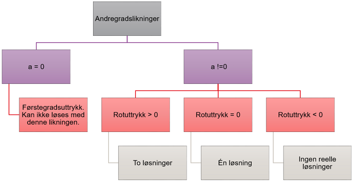

# Beslutninger

## If-tester
Vi står ofte overfor valg som har ulike utfall. Dette kan vi programmere ved å legge inn betingelser som fører til de utfallene vi ønsker. I Python har vi _if-tester_ som gjør dette. If-testene sjekker om en betingelse er utført, og kjører deretter denne betingelsen. En generell syntaks er slik (vi fjerner tegnene < og >):


```
if <betingelse>:
    beslutning
```

Betingelsen kan f.eks. være en logisk slutning som er sann eller usann. Dersom slutninger er sann, gjør programmet det som står innrykket etter kolon. Alt som har samme innrykk her, tilhører den samme beslutningen. De logiske markørene vi kan bruke i testen, er:
- Større enn: >
- Mindre enn: <
- Større enn eller lik: >=
- Mindre enn eller lik: <=
- Lik: ==
- Ikke lik: !=

Merk at logisk likhet ikke er det samme som en variabeltilordning. Når vi bruker enkelt likhetstegn, gir vi en variabel en verdi. Når vi bruker dobbelt likhetstegn, bruker vi det som i en likning, og spør i prinsippet om de to uttrykkene på hver side av likhetstegnet er det samme.

Her er et eksempel på en enkel if-test:


{:.input_area}
```python
if 2 > 3:
    print("Verden er rar")
```


Her får vi ingen output fordi betingelsen aldri er oppfylt (2 blir aldri større enn tre). Vi kan derimot skrive:


{:.input_area}
```python
if 2 < 3:
    print("Verden er normal")
```


{:.output .output_stream}
```
Verden er normal

```

Her vil vi få output fordi betingelsen er sann. Hvis vi ønsker å skrive ut noe dersom ikke betingelsen er sann, kan vi bruke else-kommandoen:


{:.input_area}
```python
if 2 < 3:
    print("Verden er normal")
else:
    print("Verden er rar")
```


{:.output .output_stream}
```
Verden er normal

```

Vi ser at else ikke skal ha en etterfølgende betingelse. Betingelsen er rett og slett at betingelsen ovenfor ikke er sann. Vi kan også teste flere betingelser enn én ved hjelp av elif:


{:.input_area}
```python
tall = input("Skriv inn et tall:")
tall = float(tall)

if tall > 0:
    print("Tallet er positivt")
elif tall < 0:
    print("Tallet er negativt")
else:
    print("Tallet er 0")
```


{:.output .output_stream}
```
Skriv inn et tall:2
Tallet er positivt

```

Det er kun if som er nødvendig å bruke, og if-setningen starter en testesekvens som kan, men som ikke må, avsluttes med else. Merk at det bare er én (den første) betingelsen som er sann, som avgjør beslutningen:


{:.input_area}
```python
tall = 2

if tall > 1:
    print("Tallet er større enn 1")
elif tall == 2:
    print("Tallet er 2")
```


{:.output .output_stream}
```
Tallet er større enn 1

```

Vi får altså ikke ut at tallet er 2 fordi den første betingelsen inntraff først. Hvis vi derimot ville ha ut begge, kan vi bruke to if-tester:


{:.input_area}
```python
tall = 2

if tall > 1:
    print("Tallet er større enn 1")
if tall == 2:
    print("Tallet er 2")
```


{:.output .output_stream}
```
Tallet er større enn 1
Tallet er 2

```

Det kan være lurt å bruke elif istedenfor else hvis en ikke er helt sikker på at alle alternativer er dekket. Med elif er en helt sikker hva som testes, mens else kan inkludere betingelser du ikke har tenkt på!

## Delelighet

Et enkelt eksempel på bruk av tester i matematikk, er å avgjøre hvorvidt et tall er delelig på et annet. En operator vi da må introdusere, er modulus. Modulus angir resten etter en heltallsdivisjon. Heltallsdivisjon kan vi utføre ved å bruke dobbel dele, //.


{:.input_area}
```python
23//6
```


{:.output .output_data_text}
```
3
```


23 heltallsdividert på 6 gir 3 fordi 3 er det høyeste heltallet som ganget med 6 gir det tallet som er nærmes mulig (men ikke over!) 23. Siden 6 ganger 3 er 18, vil vi ha en rest på 5. Dette får vi fram med modulus, %.


{:.input_area}
```python
23%6
```


{:.output .output_data_text}
```
5
```


Hvis heltallsdivisjonen går opp, blir resten 0:


{:.input_area}
```python
print("Heltallsdivisjonen 24//6 =", 24//6, "\n Rest =", 24%6)
```


{:.output .output_stream}
```
Heltallsdivisjonen 24//6 = 4 
 Rest = 0

```

Dette kan vi kombinere med input og tester for å avgjøre om et tall er delelig med et annet tall:


{:.input_area}
```python
tall1 = input("Skriv inn et tall som skal deles på et annet tall: ")
tall2 = input("Skriv inn tallet som det første tallet skal deles på: ")
tall1 = float(tall1)
tall2 = float(tall2)

if tall1%tall2 == 0:
    print(tall1, "er delelig med", tall2)
else:
    print(tall1, "er ikke delelig med", tall2)

```


{:.output .output_stream}
```
Skriv inn et tall som skal deles på et annet tall: 4
Skriv inn tallet som det første tallet skal deles på: 5
4.0 er ikke delelig med 5.0

```

Dette kan brukes til å utforske tallsystemer, partall, oddetall, delelighet og faktorisering. Spørsmålet "Er 7 en faktor i tallet X" kan jo nettopp omformuleres til "Er X%7 lik 0?".

## Et sammensatt eksempel

La oss ta et eksempel fra matematikk. Vi ønsker å lage et program som bruker andregradsformelen til å løse andregradslikninger. Først er det lurt å sette opp det matematiske uttrykket og skaffe seg en oversikt over hvilke valg en da har og hvilke mulige utfall det gir:

$$ax^2 + bx + c = 0$$  

$$x = \displaystyle \frac{-b +- \sqrt{b^2 - 4ac}}{2a}$$

Vi kan tenke at vi har et utfall der vi ikke kan bruke likningen ovenfor, nemlig hvis a = 0. Da får vi et førstegradsuttrykk og vi får løsningen x = -c/b. Dette er det første vi må ta hensyn til. Følgende veit vi at et positivt uttrykk under rottegnet gir to løsninger, mens et negativt gir ingen (reelle) løsninger. Dersom uttrykket under rottegnet er 0, vil vi igjen få kun én løsning. Vi kan stille opp de ulike valgene i et flytskjema, dersom vi ønsker å få oversikt:




La oss nå lage et program som regner ut dette. Programmet er sammensatt og inneholder flere nivåer av if-tester. Prøv å kjenne igjen strukturen fra flytskjemaet.


{:.input_area}
```python
# Andregradsløseren
from pylab import sqrt # Importerer en kvadratrotfunksjon

print("Programmet løser likninger av typen ax^2 + bx + c = 0")
a = float(input("a = "))
b = float(input("b = "))
c = float(input("c = "))

if a == 0:
    print("Funksjonen er et førstegradspolynom")
else:
    rotuttrykk = b**2 - 4*a*c
    if rotuttrykk == 0:
        x = -b/(2*a)
        print("Likningen har bare én løsning: x =",x)
    elif rotuttrykk > 0:
        x1 = (-b + sqrt(rotuttrykk))/(2*a)
        x2 = (-b - sqrt(rotuttrykk))/(2*a)
        print("Likningen har to løsninger: x_1 =", x1, "x_2 =", x2)
    elif rotuttrykk < 0:
        print("Likninga har ingen reelle løsninger!")
```


Slike programmer tar tid å forstå, men gå igjennom linje for linje og regn gjerne ut for hånd. Merk også spesielt hvordan innrykkene grupperer ulike beslutninger som hører sammen.
