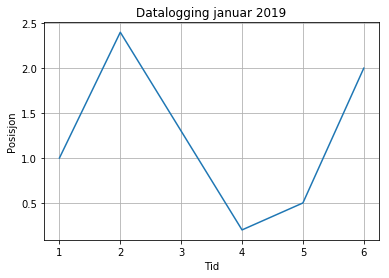
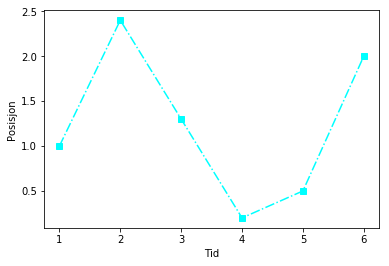
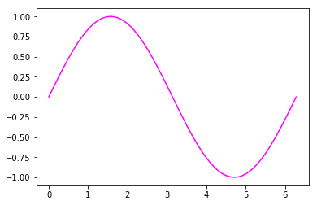
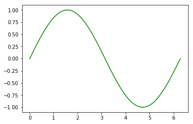
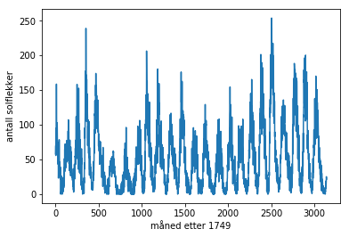

---
redirect_from:
  - "/begynneropplaring/lister-arrays-plotting"
interact_link: content/begynneropplaring/lister_arrays_plotting.ipynb
title: 'Plotting'
prev_page:
  url: /begynneropplaring/tester
  title: 'Beslutninger'
next_page:
  url: /begynneropplaring/Dag1_Del4
  title: 'Løkker'
comment: "***PROGRAMMATICALLY GENERATED, DO NOT EDIT. SEE ORIGINAL FILES IN /content***"
---

# Lister og arrays
Det er flere måter å lage lister på i Python. Her skal vi se på to av dem: lister og arrays. 
La oss anta at vi har data fra et eksperiment. Kanskje vi har logget noen tider med tilhørende posisjoner. 
Vi legger dette inn i to lister. 


{:.input_area}
```python
from pylab import *

tid = [1,2,3,4,5,6]     # Lager to lister, tid og posisjon
posisjon = [1.0, 2.4, 1.3, 0.2, 0.5, 2.0]
print("Mine tider:", tid)
print("Mine posisjonsdata:", posisjon)
```


{:.output .output_stream}
```
Mine tider: [1, 2, 3, 4, 5, 6]
Mine posisjonsdata: [1.0, 2.4, 1.3, 0.2, 0.5, 2.0]

```

Nå ser vi på hvordan vi kan endre på listen med tider. Tenk f.eks. at du egentlig målte hvert andre sekund. Vi prøver først med å ta 2*tid: 


{:.input_area}
```python
nytid = 2*tid
print("Mine tider:", tid)
print("Mine nye tider:", nytid)
```


{:.output .output_stream}
```
Mine tider: [1, 2, 3, 4, 5, 6]
Mine nye tider: [1, 2, 3, 4, 5, 6, 1, 2, 3, 4, 5, 6]

```

Du ser at dette ga en dobbelt så lang liste. Tanken var egentlig å lage denne listen: [2,4,6,8,10,12] 
Da må vi konvertere fra liste til array før vi ganger med 2. 


>*liste* og *array* er to forskjellige datatyper. I ProFag skal vi for det meste bruke arrays og unngå lister. Vi bruker gjerne arrays i matematiske sammenhenger og lister når vi skal holde orden på et sett verdier. En array må inneholde elementer av samme datatype, mens en liste kan inneholde elementer av ulike datatyper (som f.eks. tekst og heltall). 


{:.input_area}
```python
nytid=array(tid)      #konverterer fra liste til vektor (casting)
nytid=2*nytid
print("Mine tider:", tid)
print("Mine nye tider:", nytid)
```


{:.output .output_stream}
```
Mine tider: [1, 2, 3, 4, 5, 6]
Mine nye tider: [ 2  4  6  8 10 12]

```

## Oppgaver
1. Når du skriver ut en liste/matrise med verdier kan du med en gang se om det er datatype liste eller array. Hvordan?
2. Lag to lister med tall. Legg listene sammen. Hva får du?
3. Konverter de to listene til arrays. Legg dem sammen. Hva får du? 
4. Forsøk med ulike regneoperasjoner (multiplikasjon, divisjon, addisjon og subtraksjon) på lister og arrays. Se om du kan gjette hva du får før du kjører print-kommandoen. 
5. Lag en liste som inneholder ulike datatyper. Forsøk å konvertere listen til et array. Hvorfor går ikke det bra?


# Plotting
Nå skal vi lage et plot av dataene våre. Når vi plotter to lister eller vektorer mot hverandre må de være like lange, men ellers er det likegyldig hvilken datatype vi velger å bruke. Vi kan velge fritt hva vi har på førsteaksen og hva vi har på andreaksen. La oss bruke tids- og posisjonsdataene fra tidligere. 


{:.input_area}
```python
from pylab import *

plot(tid,posisjon)      # Plotter tid på 1.aksen og posisjon på 2.aksen 
# plot(posisjon,tid)      # Plotter posisjon på 1.aksen og tid på 2.aksen

xlabel("Tid")
ylabel("Posisjon")
title("Datalogging januar 2019")
grid()
show()
```


{:.output .output_png}



>Elevene er vant til x og y. Hvis vi kaller det x og y i programmet så er det kjent, men de venner seg ikke til å tenke «friere» - at man kan bytte om på første- og andreaksen eller kalle det noe helt annet. Det kan derfor være lurt å gi variablene logiske navn og ikke være for bundet av matematisk notasjon. 

### Underveisoppgaver
1. Finn ut hvordan lage ulike arrays ved hjelp av *zeros* og *ones*. Se f.eks. s. 80 i ProMod-boka. Hvis du vil bruke dette til å lage en array som er lik den som heter nytid i vårt program, trenger du kunnskap om løkker. Det kommer i neste økt, men vi gir en smakebit nedenfor. 

2. Hva skjer om du bytter ut kommandoen plot med kommandoen scatter?

4. Prøv deg med farger, linjestil og markeringer. Se eksempel under. 


#### Eksempel på plot med farger, linjestil og markeringer


{:.input_area}
```python
plot(tid,posisjon, "-.", color="cyan", marker="s")
xlabel("Tid")
ylabel("Posisjon")
```


{:.output .output_data_text}
```
Text(0,0.5,'Posisjon')
```


{:.output .output_png}



#### Eksempel på bruk av løkke for å fylle en array med tall vi ønsker


{:.input_area}
```python
mertid=zeros(6,int)    #lager en array med 6 nuller
mertid[0]=2            #setter den første verdien til 2
for i in range(1,6):   #går gjennom løkken fem ganger
    mertid[i]=mertid[i-1]+2
print(mertid)
```


{:.output .output_stream}
```
[ 2  4  6  8 10 12]

```

### Plot av sinusfunksjon
Husk at for å plotte må vi ha to arrays av samme dimensjon. 
For å plotte en sinusfunksjon trenger vi derfor å lage to arrays. En som inneholder argumentene og en som inneholder funksjonsverdiene. Jo flere punkter vi velger i arrayet, desto glattere blir sinuskurven. 
Her velger vi å plotte sinus for en hel periode. Da trenger vi matematikkbiblioteket både for pi og for sinus. 
Les gjennom program linje for linje og forklar hva som blir gjort.


{:.input_area}
```python
from pylab import *
# Minner først om hvordan vi kan lage en array med verdier
x_verdier=linspace(0,10,11)    # Verdier fra 0 til 10 fordelt på 21 punkter
print("Denne kommandoen gir følgende x-verdier:", x_verdier)

# Nå lager vi en array med 100 verdier for å plotte sinusfunskjonen

vinkel = linspace(0, 2*pi, 100)  #array går fra 0 til 2pi, med 100 steg i mellom
sinus=sin(vinkel)                #husk at vinkelen må være i radianer

plot(vinkel, sinus, c="magenta")
```


{:.output .output_stream}
```
Denne kommandoen gir følgende x-verdier: [ 0.  1.  2.  3.  4.  5.  6.  7.  8.  9. 10.]

```


{:.output .output_data_text}
```
[<matplotlib.lines.Line2D at 0x9b060b8>]
```


{:.output .output_png}



Programmet hadde blitt både mer lesbart og fleksibelt om vi deklarerer variable først. Da kan det se slik ut: 


{:.input_area}
```python
from pylab import *

#Deklarerer variable
start = 0
slutt = 2*pi
N = 100

#Lager arrays
vinkel = linspace(start, slutt, N)  #array går fra start til slutt, med N steg i mellom
sinus=sin(vinkel)                   

#Plotter vektorene mot hverandre
plot(vinkel, sinus, c="green")
```


{:.output .output_data_text}
```
[<matplotlib.lines.Line2D at 0x8980e80>]
```


{:.output .output_png}



>Elever har ikke alltid et like bevisst forhold til om vinkler gis i grader eller radianer. Det kan derfor være nyttig å vite hvoran python konverterer mellom de to. Her ser du hvordan du kan konvertere til radianer slik at den innebygde funksjonen *sin*  regner riktig når vinkelmålet blir gitt i grader. 


{:.input_area}
```python
from pylab import *

a = sin(radians(30))
print("Sinus av 30 grader =",a)

```


{:.output .output_stream}
```
Sinus av 30 grader = 0.49999999999999994

```


### Diskusjon
1. Det går fint an å bruke svært mye tid på å pynte på plot. Hvordan kan du styre dette i klassen?
2. Hva er forskjellen på å plotte i Python og Geogebra? Diskuter fordeler og ulemper med å bruke disse programmene til plotting.


# Store datasett
På Internett kan vi finne store datasett som det er artig å plotte. Vi bruker kommandoen *loadtxt* til å lese data fra en fil. Filen kan ligge lokalt hos deg eller du kan lese den direkte fra Internett. Her viser vi det siste med solflekkdata fra en fil vi har lagt på ProFags ressurssider. 


{:.input_area}
```python
data = loadtxt("https://uio-profag.github.io/pages/02_dag1/plotting_les_fra_fil/solflekker.txt", float)

maaned = data[:,0]                        #første kolonne i datasettet blir lagt i en vektor kalt maaned
antall = data[:,1]                        #andre kolonne i datasettet blir lagt i en vektor kalt antall

#print(maaned,antall)
plot(maaned,antall)
xlabel("måned etter 1749")
ylabel("antall solflekker")

"""
# Du kan velge å plotte deler av datasettet
maaned = data[0:1000, 0]
antall = data[0:1000, 1]
plot(maaned,antall)
xlabel("måned etter 1749")
ylabel("antall solflekker")
"""
```


{:.output .output_data_text}
```
'\n# Du kan velge å plotte deler av datasettet\nmaaned = data[0:1000, 0]\nantall = data[0:1000, 1]\nplot(maaned,antall)\nxlabel("måned etter 1749")\nylabel("antall solflekker")\n'
```


{:.output .output_png}



